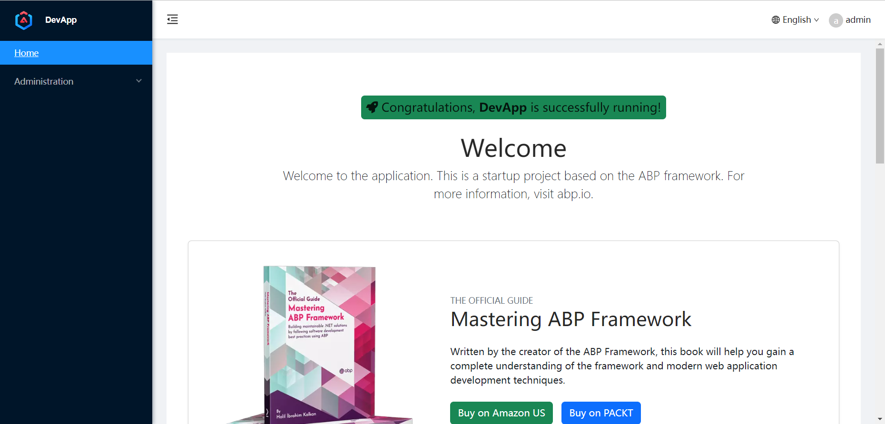
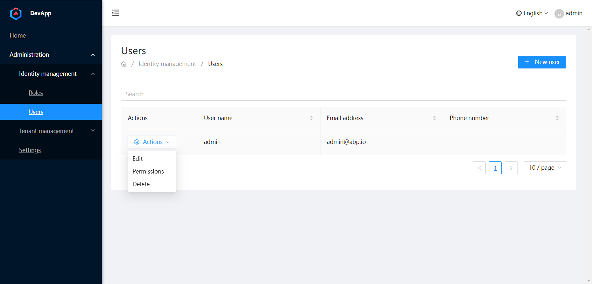

# Abp-plus

Abp plus provides ant design theme for [abp](https://github.com/abpframework/abp)'s angular project, which is based on ng-zorro.

## Screenshots

## How to use

1. Make sure you have [abp cli](https://docs.abp.io/en/abp/latest/CLI) installed.
2. Download the template zip file from [the release page](https://github.com/realZhangChi/abp-plus/releases).
   For `app` templates, download app-`{VERSION}`.zip.
   For the `app-nolayer` template, download app-nolayers-`{VERSION}`.zip.
3. Copy the template zip you downloaded to `%USERPROFILE%/.abp/templates' path. (for windows only)
4. Run the `abp new <solution-name> -u angular --version <VERSION>` command to generate the project, see [abp documentation](https://docs.abp.io/en/abp/latest/CLI#new) for details.
